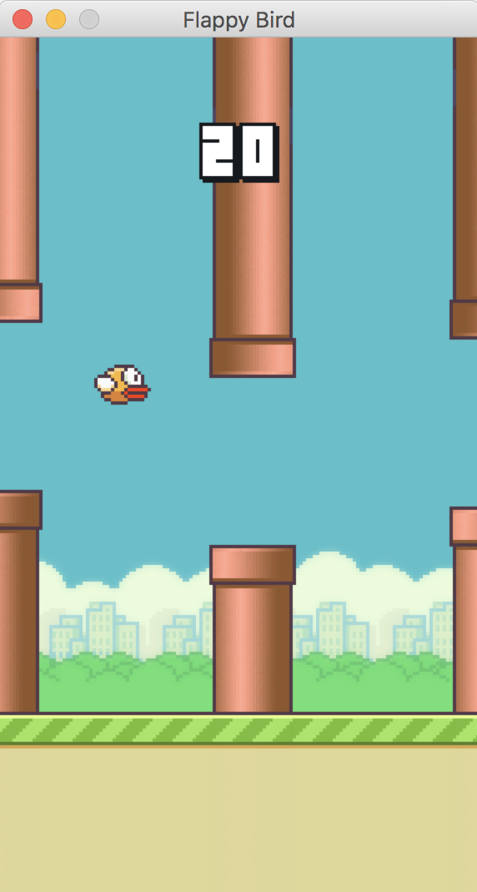

# Playing Flappy Bird with Reinforcement Learning (DQN)

A Reinforcement Learning Bot that learns how to play the game of Flappy Bird.

<table align="center" style="border: none; border-collapse: collapse;">
    <tr style="border: none;">
        <td align="center" style="border: none;">
            
        </td>
    </tr>
</table>

Implemented in Tensorflow 2.0.
Uses a modified version of [this Python version](https://github.com/sourabhv/FlapPyBird) of Flappy Bird to simulate the game.

The code on this repository serves as reference for one of my recent [blog posts](https://www.franciscosalg.com/flappy-bird-RL/). 


<table align="center" style="border: none; border-collapse: collapse;">
    <tr style="border: none;">
        <td align="center" style="border: none;">
            
        </td>
    </tr>
</table>

## Installation
Clone this repository and run ```flappy.py``` .

After playing 500 episodes, the agent should start achieving a reasonable score (>25). 

## Implementation details
Based on the original DQN paper by Deepmind [1].

<table align="center" style="border: none; border-collapse: collapse;">
    <tr style="border: none;">
        <td align="center" style="border: none;">
            
        </td>
    </tr>
    <tr style="border: none;">
        <td style="border: none;" align="center">State encoding</td> 
    </tr>
</table>

Each frame of the game is considered a state for the Q-Learning algorithm. The vector encoding each state contains 5 values:
- Horizontal distance between the player and the next pipe
- Vertical distance between the player and the lower pipe
- Vertical distance between the player and the upper pipe 
- Distance from the player to the top of the map
- Distance from the player to the base of the map

After each action, the transition to a new state is stored in a Replay Memory buffer as the tuple

(state, action, next_state, reward)

The Replay Memory was  implemented using a ring buffer. 

The policy network is implemented using a Multilayer Perceptron with 2 hidden layer with 10 neurons each. This network predicts the expected return of taking each of the available actions given the current state. Similarly to [1], a second network that is only updated every few episodes is used for computing Q(s_{t+1}). This increases the stability of the training.

Exploration is ensured using by an e-greedy policy with an annealing epsilon value.

A reward of +1 is returned at every transition to non-final state, and of -1000 when transitioning to a final state (when the bird crashes).

## References
[1] Mnih, Volodymyr, et al. "Human-level control through deep reinforcement learning." Nature 518.7540 (2015): 529-533.
